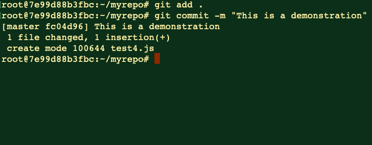
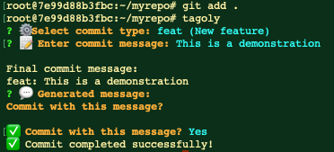
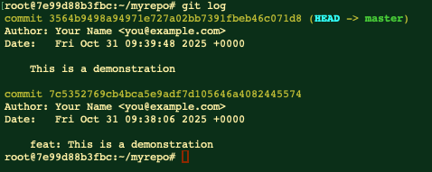

<h1 align="center">🏷️ Tagoly</h1>
<p align="center">
  <b>Smart CLI tool to streamline your Git commits.</b><br/>
  <sub>Stop typing long commit messages — Tagoly makes it instant.</sub>
</p>
<p align="center">
  
</p>

---

## 🚀 Key Features

✅ **Automatic Scope Detection** Detects the commit scope (e.g., `feature/login`, `docs/readme`) based on the paths of staged files.

✅ **Custom Tag Support** Enhance your workflow by defining your own commit tags in `.tagolycustom` (e.g., `ci`, `perf`, `hotfix`).

✅ **Interactive Commit Generation** Provides a simple, step-by-step selection process for commit type, scope, and subject message.

✅ **Smart Scope Selection** When multiple scopes are detected, Tagoly automatically suggests the most relevant scope or lets you choose manually.

---

## ⚡️ Quick Start

Tagoly is a drop-in replacement for the standard `git commit` workflow.

> ⚠️ **Note for Manual Installers:** If you download the binary directly, ensure you place it in a directory listed in your system's **PATH** (e.g., `/usr/local/bin`) to run it from any location.

```bash
# 1. Install Tagoly (Example: Homebrew)
brew tap meso1007/tagoly
brew install meso1007/tagoly/tagoly

git init   # if your repo is not initialized yet

# 2. Stage your changes
git add .

# 3. Run Tagoly interactively
tagoly
```
```powershell
# Windows (Scoop)
scoop bucket add tagoly https://github.com/meso1007/scoop-tagoly
scoop install tagoly/tagoly
tagoly --version
tagoly
```

## 🧩 Before / After

| Manual Commit | Tagoly |
| :---------------------------: | :--------------------------: |
|  |  |

### Git Log Comparison

<p align="center">
  
</p>

## ⚙️ Installation Details

### **MacOS**

#### 1. Homebrew
```bash
# Add Tap
brew tap meso1007/tagoly
# Install
brew install meso1007/tagoly/tagoly
# Verify
tagoly --version
tagoly
```


#### 2. Manual Installation
> Ensure `/usr/local/bin` (or another directory in your $PATH) exists and is accessible.
##### Apple Silicon (M1/M2)
```bash
mv tagoly-darwin-arm64 /usr/local/bin/tagoly && chmod +x /usr/local/bin/tagoly
```
##### Intel
```bash
mv tagoly-darwin-amd64 /usr/local/bin/tagoly && chmod +x /usr/local/bin/tagoly
```
--------

### **Linux**
#### 1. Homebrew (Linuxbrew)
```bash
brew tap meso1007/tagoly
brew install meso1007/tagoly/tagoly
```
#### 2. Manual Installation
AMD64
```bash
mv tagoly-linux-amd64 /usr/local/bin/tagoly && chmod +x /usr/local/bin/tagoly
```

ARM64
```bash
mv tagoly-linux-arm64 /usr/local/bin/tagoly && chmod +x /usr/local/bin/tagoly
```
--------

### **Windows**
#### 1. Scoop
```powershell
# Add bucket
scoop bucket add tagoly https://github.com/meso1007/scoop-tagoly

# Install
scoop install tagoly/tagoly

# Verify
tagoly --version
tagoly

```
#### 2. Manual Installation
> Make sure "C:\Program Files\tagoly" is in your PATH to run Tagoly from any terminal.
```powershell
Move-Item .\tagoly-windows-amd64.exe "C:\Program Files\tagoly\tagoly.exe"
```

## 🧠 Configuration Example
```json
{
  "customTags": [
    {"key": "ci", "label": "CI/CD changes"},
    {"key": "perf", "label": "Performance improvement"},
    {"key": "test", "label": "Add or update tests"},
    {"key": "hotfix", "label": "Hotfix / urgent fix"}
  ]
}
```
### 📍 Save this file as .tagolycustom in your repository root.

## 💻 Usage
```bash
git add .
tagoly   # Run Tagoly to select commit type, scope, and enter message interactively
```
## 📦 Related Repositories
| Type         | Repository                                                              |
| ------------ | ----------------------------------------------------------------------- |
| Main         | [meso1007/tagoly](https://github.com/meso1007/tagoly)                   |
| Homebrew Tap | [meso1007/homebrew-tagoly](https://github.com/meso1007/homebrew-tagoly) |
| Scoop Bucket | [meso1007/scoop-tagoly](https://github.com/meso1007/scoop-tagoly)       |

---

<p align="center">
  ⭐️ <b>If you find Tagoly useful, please give it a star!</b><br/>
  <sub>It helps the project grow and reach more developers 🚀</sub>
</p>
