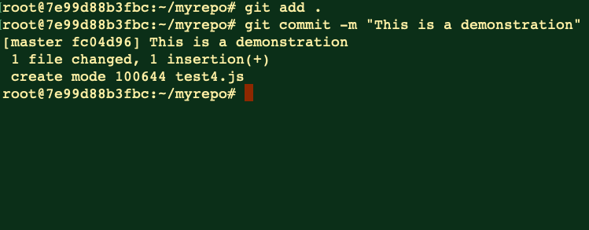
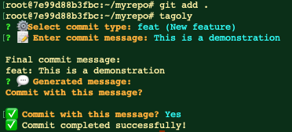
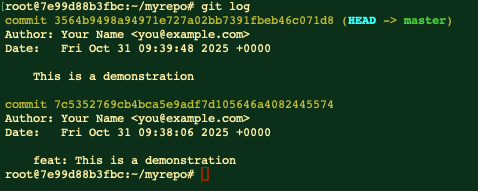

<div align="center">
  <h1>Tagoly</h1>

  <a href="https://www.tagoly-lp.us/">
    
  </a>

<p>
    <strong>The digital home for Tagoly — The smarter Git commit CLI.</strong><br />
    A high-performance landing page designed to showcase features, streamline installation, and onboard developers.
  </p>

<p align="center">
  <a href="https://www.tagoly-lp.us/"><b>Live Site</b></a>
  &nbsp;&nbsp;︱&nbsp;&nbsp;
  <a href="https://github.com/meso1007/tagoly"><b>Tagoly CLI</b></a>
  &nbsp;&nbsp;︱&nbsp;&nbsp;
  <a href="https://github.com/meso1007/tagoly-lp"><b>Togoly LP</b></a>
</p>
</div>

<p align="center">
  
</p>

## Why Tagoly

Tagoly streamlines commit writing for teams that want more consistency in commit history without adding process overhead.  
It guides each commit interactively and helps keep scopes and tags structured across repositories.

## Features

- **Automatic scope detection** based on staged file paths (for example, `feature/login`, `docs/readme`).
- **Interactive commit flow** for selecting type, scope, and subject in a clear step-by-step prompt.
- **Smart scope suggestion** when multiple scopes are detected, with manual override when needed.
- **Custom tags** via `.tagolycustom` (for example, `ci`, `perf`, `hotfix`).

## Quick Start

Install Tagoly, stage your changes, then run the CLI:

```bash
brew tap meso1007/tagoly
brew install meso1007/tagoly/tagoly

git add .
tagoly
```

For Windows:

```powershell
scoop bucket add tagoly https://github.com/meso1007/scoop-tagoly
scoop install tagoly/tagoly

git add .
tagoly
```

## Installation

### macOS

Homebrew:

```bash
brew tap meso1007/tagoly
brew install meso1007/tagoly/tagoly
tagoly --version
```

Manual install (ensure destination directory is in your `PATH`):

Apple Silicon:

```bash
mv tagoly-darwin-arm64 /usr/local/bin/tagoly
chmod +x /usr/local/bin/tagoly
```

Intel:

```bash
mv tagoly-darwin-amd64 /usr/local/bin/tagoly
chmod +x /usr/local/bin/tagoly
```

### Linux

Homebrew (Linuxbrew):

```bash
brew tap meso1007/tagoly
brew install meso1007/tagoly/tagoly
```

Manual install (AMD64):

```bash
mv tagoly-linux-amd64 /usr/local/bin/tagoly
chmod +x /usr/local/bin/tagoly
```

Manual install (ARM64):

```bash
mv tagoly-linux-arm64 /usr/local/bin/tagoly
chmod +x /usr/local/bin/tagoly
```

### Windows

Scoop:

```powershell
scoop bucket add tagoly https://github.com/meso1007/scoop-tagoly
scoop install tagoly/tagoly
tagoly --version
```

Manual install (ensure `C:\Program Files\tagoly` is in `PATH`):

```powershell
Move-Item .\tagoly-windows-amd64.exe "C:\Program Files\tagoly\tagoly.exe"
```

## Configuration

Create `.tagolycustom` in your repository root:

```json
{
  "customTags": [
    { "key": "ci", "label": "CI/CD changes" },
    { "key": "perf", "label": "Performance improvement" },
    { "key": "test", "label": "Add or update tests" },
    { "key": "hotfix", "label": "Hotfix / urgent fix" }
  ]
}
```

## Usage

```bash
git add .
tagoly
```

## Before / After

| Manual Commit | Tagoly |
| :--: | :--: |
|  |  |

### Git Log Comparison

<p align="center">
  
</p>

## Related Repositories

- [meso1007/tagoly](https://github.com/meso1007/tagoly)
- [meso1007/homebrew-tagoly](https://github.com/meso1007/homebrew-tagoly)
- [meso1007/scoop-tagoly](https://github.com/meso1007/scoop-tagoly)

---

If Tagoly helps your workflow, a star is always appreciated.
